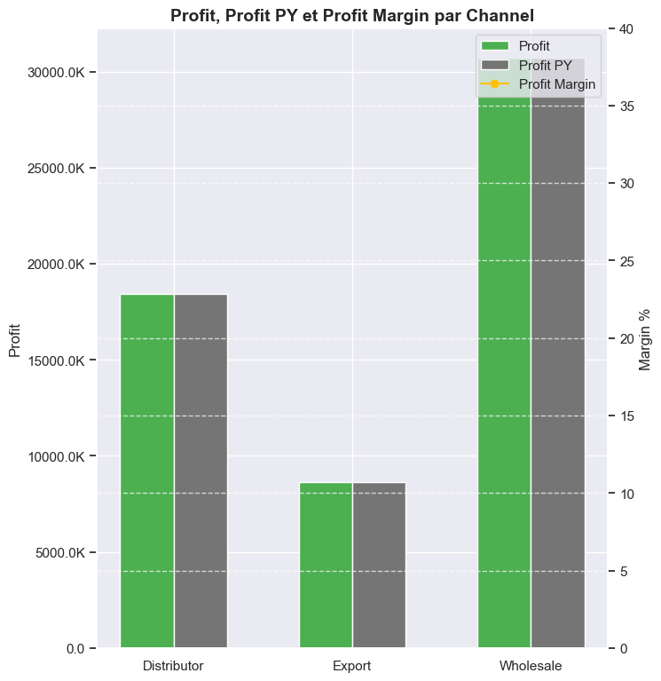

# Rapport du Modèle d'Analyse Multidimensionnelle des Ventes

### Maintainer:  Saha Merlin ( Cours **Python pour le Data Science**)

## Sommaire
1. [Introduction](#1-introduction)

2. [Architecture du Système](#2-architecture-du-système)

3. [Installation et Configuration](#3-installation-et-configuration)

4. [Structure des Données](#4-structure-des-données)

5. [Fonctionnalités Clés](#5-fonctionnalités-clés)

6. [Métriques et Indicateurs](#6-métriques-et-indicateurs)

7. [Visualisations](#7-visualisations)

8. [Guide d'Utilisation](#8-guide-dutilisation)

| Indicateur              | Valeur          |
| ----------------------- | --------------- |
| **Total des ventes**    | $154,573,140.60 |
| **Profit total**        | $57,789,142.91  |
| **Marge bénéficiaire**  | 37.39%          |
| **Nombre de commandes** | 7,991           |


## 1. Introduction

Le Modèle d'Analyse Multidimensionnelle des Ventes est une solution Python conçue pour analyser et visualiser les données de ventes d'une entreprise. Cette application faites en 2 version (Python et Notebook) répond aux besoins d'analyse des performances commerciales, financières et opérationnelles en transformant des données brutes en informations exploitables et en visualisations claires.

### 1.1 Objectifs de l'Application

L'application vise à répondre aux besoins métiers suivants :
- Effectuer le nettoyage et la transformation de données sur la vente
- Créer des visuels , des tableaux de bord et des rapports interactifs, dynamiques et attrayants pour l’étude de la force de vente.
- Analyser les résultats de la vente fournis dans le fichier Excel « sales.xlsx ».

### 1.2 Technologies Utilisées

L'application s'appuie sur un écosystème de bibliothèques Python spécialisées :
- **Python 3.11+** : Langage de programmation principal
- **pandas** : Manipulation et analyse des données
- **numpy** : Calculs numériques et manipulation de tableaux
- **matplotlib** et **seaborn** : Création de visualisations, graphiques et Amélioration de l'esthétique des visualisations
- **openpyxl**: Lecture des fichiers Excel (implicitement utilisé par pandas)

## 2. Architecture du Système

Le système adopte une architecture modulaire avec séparation claire des responsabilités, facilitant la maintenance et l'extension.

### 2.1 Diagramme de Flux

```
┌─────────────────┐     ┌─────────────────┐     ┌─────────────────┐
│  Chargement des │     │ Transformation  │     │  Création de la │
│     données     │────▶│  des données    │────▶│  table de dates │
└─────────────────┘     └─────────────────┘     └─────────────────┘
         │                      │                        │
         │                      │                        │
         ▼                      ▼                        ▼
┌─────────────────┐     ┌─────────────────┐     ┌─────────────────┐
│   Calcul des    │     │  Génération des │     │   Affichage     │
│    métriques    │────▶│  visualisations │────▶│  des résultats  │
└─────────────────┘     └─────────────────┘     └─────────────────┘
```

### 2.2 Composants Principaux

Le système est divisé en cinq composants principaux :

1. **Module de chargement des données `def load_data(file_path)`** : Responsable de l'extraction des données depuis le fichier Excel source.
2. **Module de transformation `def transform_data(sales_orders, customers, regions, products)`** : Nettoie, structure et enrichit les données brutes.
3. **Générateur de table de dates `def create_date_table(start_date, end_date)`** : Crée une table de référence temporelle complète.
4. **Calculateur de métriques `def create_measures(sales_data, date_table)`** : Calcule les indicateurs clés de performance.
5. **Générateur de visualisations `def create_visualizations(measures)`** : Crée les représentations graphiques des données.
6. **Module principale  `def run_sales_analysis(file_path)`** : pour exécuter l'analyse complète.

## 3. Installation et Configuration

### 3.1 Prérequis

Pour utiliser cette application, vous aurez besoin de :
- Python 3.11 ou supérieur
- pip (gestionnaire de paquets Python)

### 3.2 Dépendances

Les bibliothèques Python suivantes sont nécessaires :
```shell
# requirements.txt
pandas
numpy
matplotlib
seaborn
openpyxl
scikit-learn
```

### 3.3 Procédure d'Installation

1. Clonez le dépôt ou téléchargez le code source
```shell
git clone https://github.com/devsahamerlin/python-ds-sales-analysis.git

cd python-ds-sales-analysis
```
2. Créez un environnement virtuel et activez-le :
```bash
python3 -m venv dsproject
source dsproject/bin/activate # Unix/MacOS
dsproject\Scripts\activate     # Windows
```
3. Installez les dépendances :
```bash
pip install -r requirements.txt
```

### 3.4 Exécution
L'application peut être exécutée via un notebook Jupyter ou en ligne de commande :

#### 3.4.1 Avec Jupyter Notebook : https://docs.jupyter.org/en/latest/running.html
```shell
jupyter notebook main.ipynb
```

#### 3.4.2 En ligne de commande
```shell
python3 main.py
```

### 3.5 Configuration

L'application n'a pas besoin de configuration spécifique, mais vous pouvez personnaliser certains paramètres comme :
- Les palettes de couleurs pour les visualisations
- Les formats d'affichage des valeurs monétaires
- La période d'analyse

## 4. Structure des Données

### 4.1 Schéma des Données d'Entrée

L'application utilise comme source principale un fichier Excel (data/sales.xlsx) structuré en quatre feuilles :

#### 4.1.1 Feuille "Sales Orders"
| Colonne | Type | Description |
|---------|------|-------------|
| OrderNumber | Chaîne | Identifiant unique de la commande |
| OrderDate | Date | Date de la commande |
| Ship Date | Date | Date d'expédition |
| Customer Name Index | Entier | Référence au client (clé étrangère) |
| Channel | Chaîne | Canal de vente (Wholesale, Distributor, Export) |
| Currency Code | Chaîne | Devise (AUD, EUR, GBP, NZD, USD) |
| Warehouse Code | Chaîne | Code de l'entrepôt |
| Delivery Region Index | Entier | Référence à la région de livraison (clé étrangère) |
| Product Description Index | Entier | Référence au produit (clé étrangère) |
| Order Quantity | Entier | Quantité commandée |
| Unit Selling Price | Décimal | Prix unitaire de vente |
| Unit Cost | Décimal | Coût unitaire du produit |

#### 4.1.2 Feuille "Customers"
| Colonne | Type | Description |
|---------|------|-------------|
| Customer Index | Entier | Identifiant unique du client (clé primaire) |
| Customer Names | Chaîne | Nom du client |
| Size | Chaîne | Taille du client (Big, Medium) |
| Capital | Décimal | Capital du client |


#### 4.1.3 Feuille "Regions"
| Colonne | Type | Description |
|---------|------|-------------|
| Index | Entier | Identifiant unique de la région (clé primaire) |
| Suburb | Chaîne | Quartier |
| City | Chaîne | Ville |
| postcode | Chaîne | Code postal |
| Longitude | Décimal | Coordonnée de longitude |
| Latitude | Décimal | Coordonnée de latitude |
| Full Address | Chaîne | Adresse complète |

#### 4.1.4 Feuille "Products"
| Colonne | Type | Description |
|---------|------|-------------|
| Index | Entier | Identifiant unique du produit (clé primaire) |
| Product Name | Chaîne | Nom du produit |

### 4.2 Modèle de Données Transformé

L'application transforme les données sources en un modèle dimensionnel en étoile, particulièrement adapté à l'analyse OLAP :

```
                   ┌─────────────┐
                   │ Date Table  │
                   │ (Dimension) │
                   └─────────────┘
                          ▲
                          │
┌─────────────┐    ┌─────────────┐    ┌─────────────┐
│  Customers  │◄───│ Sales Data  │───►│  Products   │
│ (Dimension) │    │   (Faits)   │    │ (Dimension) │
└─────────────┘    └─────────────┘    └─────────────┘
                          │
                          ▼
                   ┌─────────────┐
                   │   Regions   │
                   │ (Dimension) │
                   └─────────────┘
```

Les tables sont reliées par des clés étrangères permettant de joindre facilement les informations connexes.

### 4.3 Enrichissements et Calculs

À partir des données brutes, plusieurs calculs sont effectués :

- **Sales** = Order Quantity × Unit Selling Price
- **Cost** = Order Quantity × Unit Cost
- **Profit** = Sales - Cost
- **Profit Margin (%)** = (Profit / Sales) × 100

## 5. Fonctionnalités Clés

### 5.1 Extraction et Transformation des Données: ETL (Extract, Transform, Load)
L'application effectue plusieurs opérations de transformation :

1. **Extraction** : Lecture des feuilles Excel via pandas
2. **Transformation** :
   - Conversion des types de données (dates, numériques)
   - Calculs dérivés (ventes, profits, marges)
   - Jointures entre les tables de dimensions et de faits
3. **Chargement** : Création d'un DataFrame unique enrichi pour l'analyse

### 5.2 Table de Dates

La table de dates générée inclut :
- Hiérarchie temporelle (année, trimestre, mois, semaine, jour)
- Noms des jours et des mois
- Indicateurs spéciaux (fin de mois, début de mois, weekend)
- Clés de jointure formatées

### 5.3 Analyse Year-Over-Year (YOY)

La fonction `same_period_last_year` permet de comparer automatiquement les performances actuelles avec celles de l'année précédente pour n'importe quelle métrique :
- Calcul des valeurs pour l'année précédente
- Calcul des variations en valeur absolue
- Calcul des variations en pourcentage

### 5.4 Analyses Multidimensionnelles

L'analyser les données selon plusieurs dimensions :
- Temporelle (année, mois)
- Produit
- Client
- Géographique (ville)
- Canal de vente

## 6. Métriques et Indicateurs

### 6.1 Métriques Commerciales

#### 6.1.1 Chiffre d'Affaires
```python
total_sales = sales_with_dates['Sales'].sum()
```

### 6.2 Métriques Financières

#### 6.2.1 Profit Total
```python
total_profit = sales_with_dates['Profit'].sum()
```

#### 6.2.3 Marge Bénéficiaire
```python
profit_margin_pct = (total_profit / total_sales) if total_sales > 0 else 0
```

### 6.3 Indicateurs d'Activité

```python
total_orders = len(measures['sales_with_dates']['OrderNumber'].unique())
```

## 7. Visualisations

L'application génère plusieurs types de visualisations pour présenter les données de manière claire et exploitable.

### 7.1 Cartes KPI

Des cartes KPI présentent les indicateurs clés de performance :
- Total des ventes
- Profit total
- Marge bénéficiaire
- Nombre total de commandes


### 7.2 Graphiques Comparatifs

#### 7.2.1 Ventes par Produit
Un graphique à barres montrant :
- Les ventes actuelles par produit
- Les ventes de l'année précédente
- Une ligne de tendance


#### 7.2.2 Ventes par Mois
Un graphique à barres montrant :
- Les ventes mensuelles de l'année en cours
- Les ventes mensuelles de l'année précédente
- Une ligne de tendance


### 7.3 Graphique Circulaire

Un diagramme circulaire présente les ventes par ville, avec :
- Pourcentage de chaque ville dans les ventes totales
- Valeurs absolues des ventes
- Légende détaillée


### 7.4 Analyse des Canaux de Vente

Un graphique combiné montrant :
- Profits actuels et de l'année précédente par canal (barres)
- Marge bénéficiaire par canal (ligne)



### 7.5 Analyse des Clients

Deux graphiques à barres horizontales présentant :
- Les 5 meilleurs clients avec comparaison année précédente
- Les 5 moins bons clients avec comparaison année précédente


## 8. Guide d'Utilisation

### 8.1 Exécution de l'Application

Pour exécuter l'application, utilisez le script principal :

```python
if __name__ == "__main__":
    file_path = "data/sales.xlsx"
    results = run_sales_analysis(file_path)


    # Afficher les visualisations
    plt.figure(results['kpi_fig'].number)
    plt.figure(results['main_fig'].number)
    plt.show()

    # results['main_fig'].savefig('images/sales_analysis.png', dpi=300, bbox_inches='tight')
    # results['kpi_fig'].savefig('images/kpi_dashboard.png', dpi=300, bbox_inches='tight')
    #
    # results['sales_data'].to_excel('transformed_sales_data/transformed_sales_data.xlsx', index=False)
    # results['measures']['monthly_measures'].to_csv('transformed_sales_data/monthly_sales.csv', index=False)

    # Afficher quelques statistiques clés
    print(f"Total Sales: ${results['measures']['total_sales']:,.2f}")
    print(f"Total Profit: ${results['measures']['total_profit']:,.2f}")
    print(f"Profit Margin: {results['measures']['profit_margin_pct'] * 100:.2f}%")
```

### 8.2 Interprétation des Résultats

#### 8.2.1 Lecture des Cartes KPI
Les cartes KPI fournissent un aperçu rapide des performances globales.
#### 8.2.2 Analyse des Tendances
Pour identifier les tendances :
- Comparez la hauteur des barres entre l'année en cours et l'année précédente
- Observez la direction des lignes de tendance
- Repérez les pics et les creux saisonniers

#### 8.2.3 Identification des Opportunités
Pour identifier les opportunités d'amélioration :
- Examinez les produits avec une croissance ou un déclin significatif
- Analysez les performances des clients
- Comparez les marges bénéficiaires par canal

### 8.3 Exportation des Résultats

Les visualisations peuvent être exportées au format PNG, PDF ou SVG :

```python
# Exporter les graphiques
results['main_fig'].savefig('images/sales_analysis.png', dpi=300, bbox_inches='tight')
results['kpi_fig'].savefig('images/kpi_dashboard.png', dpi=300, bbox_inches='tight')
```

Les données transformées peuvent être exportées au format Excel ou CSV :

```python
# Exporter les données transformées
results['sales_data'].to_excel('transformed_sales_data/transformed_sales_data.xlsx', index=False)
results['measures']['monthly_measures'].to_csv('transformed_sales_data/monthly_sales.csv', index=False)
```

---

© 2025 - Saha Merlin - Modèle d'Analyse Multidimensionnelle des Ventes
